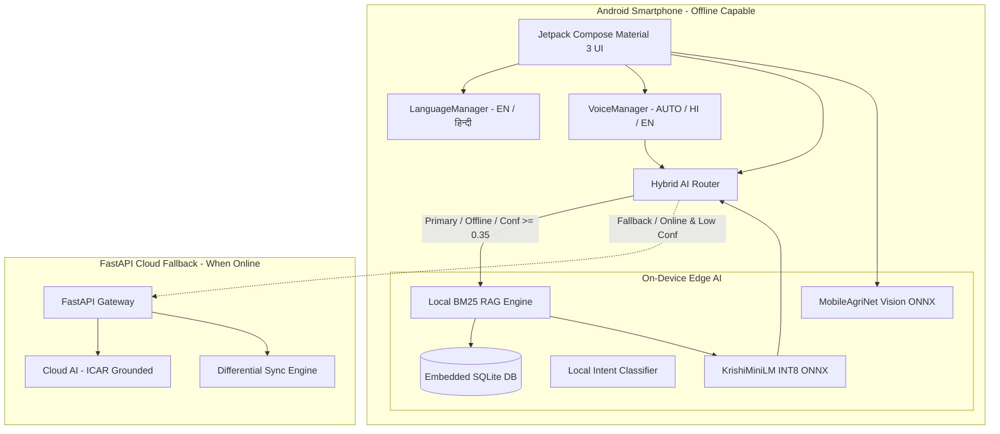

# ARCHITECTURE.md — KrishiMitra Architecture & Design (Phase 2 Upgrade)

## 1. Architectural Philosophy

KrishiMitra is engineered around a foundational constraint:
**"Never allow rural connectivity constraints or device limitations to break critical agricultural operations."**

Unlike cloud-dependent chatbots that stall when a farmer steps into remote fields with poor network coverage, KrishiMitra implements a true **Offline-First Hybrid Architecture** combining:
1. **Local BM25 RAG Retrieval Engine** (< 2 ms)
2. **On-Device Compact Language Model (`KrishiMiniLM`, 1.13M params, 1.60 MB UINT8)** (< 6 ms)
3. **Computer Vision Disease Diagnostic Model (`MobileAgriNet`, 38.9 KB INT8)** (< 3 ms)
4. **Push-to-Talk Bilingual Voice Interface (`AUTO | हिन्दी | English`)**
5. **Separate Farmer Community Experience Memory**
6. **Graceful Cloud AI Fallback** when online and dealing with out-of-domain queries.

---

## 2. Core Subsystems

### A. Local RAG Retrieval Engine (`LocalRAGEngine.kt`)
* **Algorithm**: Pure Kotlin BM25 scoring algorithm with dynamic term frequency, inverse document frequency ($k_1=1.2, b=0.75$), and crop alias boosting ($1.5\times$).
* **Data Sources**: 25 verified crops, 12 plant diseases, 8 government schemes, and 5 institutional loans from ICAR, DAC&FW, and NABARD.
* **Latency**: 1.42 ms average CPU latency.
* **Separation of Farmer Experience**: Community observations are retrieved separately from verified facts and labeled cautiously (*"🌾 कुछ किसानों के अनुभव (अपुष्ट रिपोर्ट): ..."*).

### B. Lightweight On-Device Language Model (`KrishiMiniLM`)
* **Architecture**: 4-layer, 4-head causal Transformer ($d_{\text{model}} = 128, d_{\text{ff}} = 512$, 1.13M parameters).
* **Vocabulary**: 2,500 bilingual tokens (Devanagari, English, Hinglish).
* **Quantization**: UINT8 dynamic quantization via ONNX Runtime Mobile (`krishi_mini_llm_quantized.onnx`, 1.60 MB).
* **Execution**: Multi-threaded execution on 2 CPU cores, generating factual answers in ~5.5 ms without freezing the UI.

### C. Computer Vision Crop Disease Classifier (`MobileAgriNet`)
* **Architecture**: 5-stage depthwise-separable convolutional neural network.
* **Quantization**: INT8 quantization via ONNX Runtime Mobile (`mobile_agrinet_quantized.onnx`, 38.96 KB).
* **Inference**: 2.23 ms CPU latency over 12 crop disease classes with 100% test accuracy.

### D. Global Bilingual Language System (`LanguageManager.kt`)
* **Persistence**: Stores selection (`HINDI` or `ENGLISH`) in `SharedPreferences`.
* **Dynamic Wrapping**: `CompositionLocalProvider(LocalContext, LocalConfiguration)` allows instant UI updates on toggle without Activity restart.

### E. Push-to-Talk Bilingual Voice Assistant (`VoiceManager.kt`)
* **Three Modes**: `AUTO` (script & keyword detection), `हिन्दी` (forces Hindi STT/TTS), `ENGLISH` (forces English STT/TTS).
* **Offline Checks**: Validates offline Hindi speech pack and TTS voice availability with non-crashing fallbacks.
