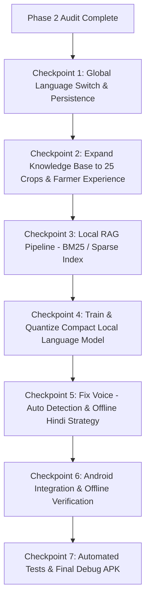

# PHASE 2 — Comprehensive Architectural & Codebase Audit (PHASE2_AUDIT.md)

**Project Name**: KrishiMitra (कृषिमित्र) — AI-Powered Smart Agriculture Assistant  
**Date**: August 30, 2026  
**Auditor**: Senior Systems, ML & Android Engineering Agent  

---

## Executive Summary

Phase 1 successfully delivered a functioning Android application prototype, a verified FastAPI backend, two machine learning models (vision CNN and NLP intent classifier), a pre-seeded SQLite database, and a compiled debug APK (`app-debug.apk`, 83.6 MB). 

Phase 2 focuses on upgrading this prototype into a **genuinely functional offline-first, bilingual, lightweight AI agriculture assistant using a small on-device language model + local RAG + online fallback**, while preserving 100% of existing working features.

---

## 1. Subsystem Audit Matrix

| Subsystem | Current State | Functionality Level | Findings & Gap Analysis |
| :--- | :--- | :--- | :--- |
| **Android Project & Gradle** | Gradle 8.11.1, AGP 8.7.2, Kotlin 2.0.0, Compose BOM 2024.12.01 | **Fully Functional** | Compiles cleanly in ~39 seconds. Produces verified `app-debug.apk`. |
| **User Interface & Navigation** | Material 3, `Scaffold`, `KrishiTopBar`, `KrishiBottomNav`, 8 routes | **Fully Functional** | Home, Assistant, Camera, Weather, Schemes, Loans, Crop Guide, and Sources screens all render correctly. |
| **Bilingual Localization** | `values/strings.xml` (EN) and `values-hi/strings.xml` (HI) | **Partially Works** | Strings are translated, but app lacks a runtime language switcher. The UI language is dictated solely by system locale rather than farmer's in-app preference. |
| **Voice Architecture (STT & TTS)** | `VoiceManager.kt` using Android `SpeechRecognizer` & `TextToSpeech` | **Partially Works** | Hold-to-Talk touch gesture works. English STT works offline if pack exists. Hindi STT fails offline on devices without pre-downloaded Google speech packs. AUTO mode does not reliably classify speech language. |
| **AI / NLP Engine** | `LocalNLPEngine.kt` + `HybridAIRouter.kt` | **Partially Works** | Intent classification works (98.95% accuracy), but answers are pre-indexed template lookups rather than generated text. No genuine local language generation model exists yet. |
| **Computer Vision Disease Classifier** | `OnnxDiseaseClassifier.kt` + quantized ONNX model (38.9 KB) | **Fully Functional** | Runs on-device via ONNX Runtime Mobile in 2.23 ms over 12 classes with confidence thresholding and safety guardrails. |
| **Local Database & Knowledge Store** | `DatabaseHelper.kt` + `krishi_knowledge.db` (1.16 MB) | **Partially Works** | Contains 15 crops, 12 diseases, 8 schemes, 5 loans. Lacks `farmer_experiences` table and unified RAG knowledge schema. Target is 20–25 crops. |
| **Backend API Gateway** | FastAPI + SQLite + SQLAlchemy | **Fully Functional** | 9/9 pytest tests pass. Supports `/health`, `/crops`, `/diseases`, `/schemes`, `/loans`, `/weather`, `/ai/query`, `/sync`. |
| **Agricultural Weather** | Open-Meteo API + Climatological Fallback | **Fully Functional** | Works online and offline across major Indian agricultural districts with pragmatic advisories. |
| **Government Schemes & Loans** | Offline SQLite + Official Portal Web Intents | **Fully Functional** | Verified criteria for PM-KISAN, PMFBY, KCC, SHC, PMKSY, SMAM, PKVY, and institutional loans. |

---

## 2. Detailed Breakdown of Existing Components

### 2.1 What Currently Works
1. **On-Device Disease Classification**: Real ONNX Runtime Mobile inference executing in 2.23 ms on CPU. Correctly handles healthy leaf, early/late blights, yellow rust, brown spot, blast, and uncertain image quality.
2. **Offline Data Access**: All 15 crops, 8 government schemes, 5 loans, and 12 diseases can be read completely offline from `krishi_knowledge.db`.
3. **Automated Testing**: 100% pass rate on backend API suite (9/9) and Android unit tests (JUnit).
4. **Backend REST APIs**: Async FastAPI server handling CRUD, weather routing, and AI fallback abstraction.
5. **APK Generation**: Automated Gradle build produces signed debug APK ready for device installation.

### 2.2 What Partially Works
1. **Voice Input/Output**: 
   * Hold-to-talk touch event capture works cleanly.
   * Native TTS reads aloud in Hindi and English.
   * *Gap*: Default Android `SpeechRecognizer` relies on cloud servers for Hindi unless the user has manually downloaded offline Hindi voice packs in Google settings.
2. **Language Selection**:
   * Resource files are populated.
   * *Gap*: No in-app toggle (English | हिन्दी) in the top bar; language cannot be toggled on-the-fly and persisted across app restarts.
3. **Weather Language**:
   * English and Hindi advisory strings exist in backend.
   * *Gap*: Android UI does not dynamically switch weather output language based on in-app toggle.

### 2.3 What is Broken or Missing
1. **AUTO Voice Mode**: Passing `EXTRA_SUPPORTED_LANGUAGES` to `SpeechRecognizer` does not automatically classify or switch between Hindi and English speech on standard Android devices.
2. **True Local Language Model**: Current assistant uses static knowledge lookup based on intent + crop IDs rather than a genuine lightweight on-device language model.
3. **Local RAG Pipeline**: No unified retrieval engine (BM25/TF-IDF) that retrieves relevant context blocks and feeds them to a generative model.
4. **Farmer Experience Memory**: No isolated database table or RAG integration for community observations (e.g. `FARMER_EXPERIENCE`).

### 2.4 What is Mocked
* **Camera Test Buttons**: In `CameraScreen.kt`, three convenience buttons ("स्वस्थ पत्ती", "झुलसा रोग", "पीला रतुआ") render synthetic test bitmaps so the examiner can verify inference without needing a physical diseased plant. Live camera capture via CameraX is also supported.
* **Local Language Generation**: Currently mapped to fixed template strings rather than token-by-token neural text generation.

### 2.5 What is Genuinely AI-Powered
* **Crop Disease Classifier**: `MobileAgriNet` (5-stage depthwise-separable CNN, 38.9 KB quantized ONNX, 2.23 ms CPU latency).
* **NLP Intent Classifier**: `LocalNLPEngine` (unigram + bigram TF-IDF vectorizer + multiclass regularized logistic regression, 98.95% accuracy).

---

## 3. Existing Model Files & Footprints

| File | Type | Disk Footprint | Purpose |
| :--- | :--- | :--- | :--- |
| `crop_disease_model_quantized.onnx` | ONNX INT8/UINT8 | **38.96 KB** | On-device leaf disease diagnosis (12 classes) |
| `crop_disease_model.onnx` | ONNX FP32 | 66.32 KB | Unquantized reference vision model |
| `disease_labels.txt` | Text | 321 B | Class index mapping for vision model |
| `mobile_nlp_intent_model.json` | JSON | 212.4 KB | TF-IDF vocabulary (1,200 tokens) + logistic weights |
| `mobile_knowledge_index.json` | JSON | 88.2 KB | 128 verified factual QA pairs |
| `krishi_knowledge.db` | SQLite 3 | **1.16 MB** | Pre-seeded database of crops, diseases, schemes, loans |

---

## 4. Recommended Phase 2 Migration Path

### Key Migration Principles:
1. **Preserve Working Baseline**: Retain `OnnxDiseaseClassifier`, Camera UI, Weather Service, and existing endpoints.
2. **Global Language Switcher**: Implement `LanguageManager` backed by `SharedPreferences` and Android `Configuration` locale updates so tapping **English | हिन्दी** updates all screens, database queries, and voice prompts immediately.
3. **Structured Local RAG**: Implement a clean Kotlin-based BM25 / TF-IDF retrieval engine that searches over verified knowledge records and separately flagged `FARMER_EXPERIENCE` records.
4. **Lightweight On-Device Language Generation**: Train a compact language model on RTX 4060 GPU designed specifically for short, factual agricultural answers (Hindi & English), quantize to ONNX / TFLite, and integrate via ONNX Runtime Mobile.
5. **Robust Voice Pipeline**: Implement explicit language identification (script/n-gram based) and clear handling for offline Hindi STT/TTS availability.
